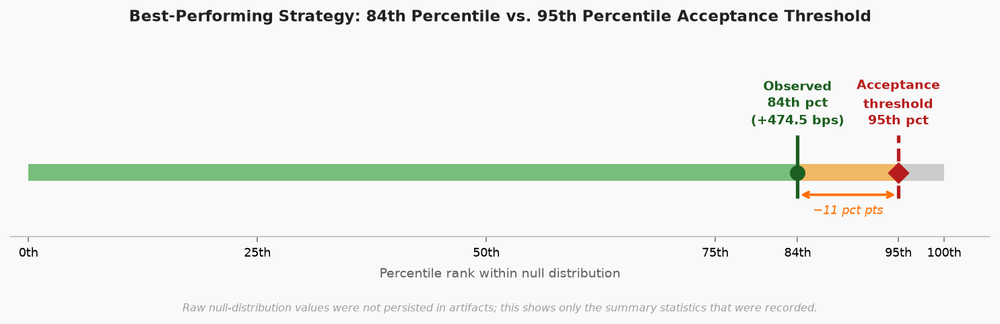
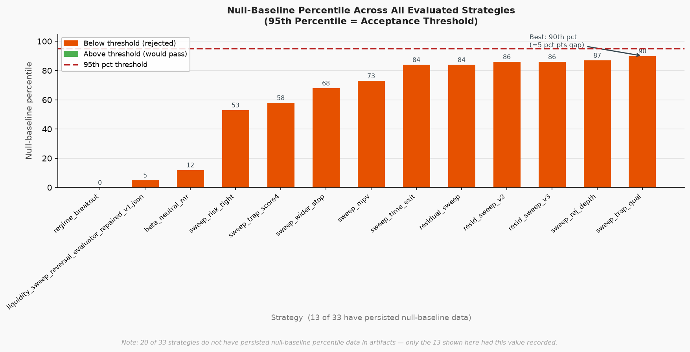
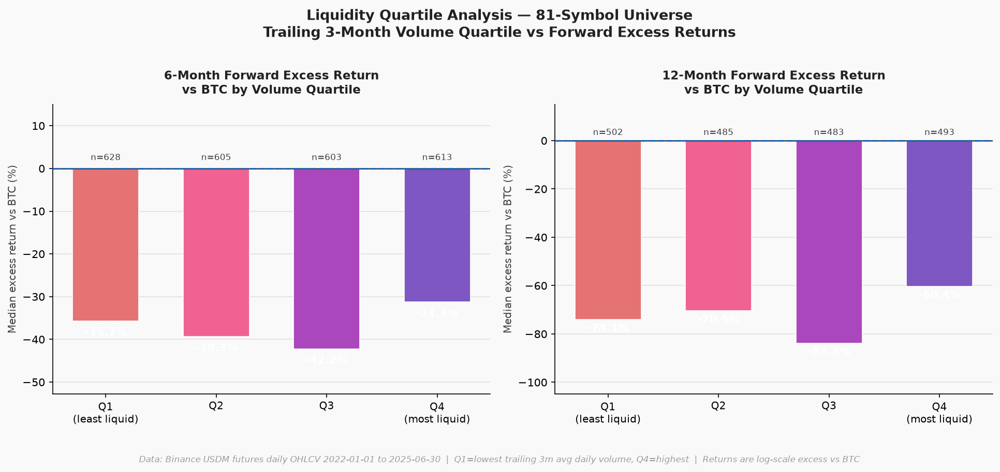

# Edge Factory OS


> **TL;DR:** Systematically tested 33 crypto trading strategies across 7 hypothesis families (81 symbols, Binance/OKX, 34 months of data). Result: 0 strategies promoted to deployment — including one candidate that looked strong (+474.5 bps) but was rejected for falling below the statistical significance bar (84th percentile vs. 95th threshold). Full audit trail, worked notebook walkthrough, and unit-tested core statistics documented below.

> **Note:** This repository contains substantial governance scaffolding
> (risk gates, approval workflows, orchestration) built preemptively for
> production use if a validated signal had been found. Since no signal
> passed validation, this scaffolding remains unexercised — see "Verified
> vs. Unverified Components" below. Some lower-priority tooling has been
> moved to `tools/archive/` for clarity; it is not deleted.

## Research at a Glance

> **Note on scope:** The high file count in `tools/` reflects each research
> iteration generating its own verification/governance script as part of
> an iterative research workflow, not a single monolithic codebase written
> in one pass. Superseded script versions have been moved to `tools/archive/`
> for clarity.

- 81 perpetual futures symbols (Binance/OKX)
- 34 months of historical data (Jan 2023 - Oct 2025)
- 33 strategy evaluations executed
- 240 research artifacts generated (full audit trail)
- 17 unique rejection/closure classifications, all ending in rejection or "no edge, no candidate"
- Final outcome: 0 strategies promoted to deployment

This is not a trading bot repository. This is a research pipeline built to
systematically generate, test, and reject crypto trading hypotheses at scale
— with an emphasis on not fooling myself about whether a signal is real.

Result: no statistically significant, cost-adjusted edge was found in any
of the 7 research hypothesis families tested (grouped by route:
binance_okx_overlap, binance_okx_group2, binance_spot_perp,
crypto_15m_idiosyncratic_sweep_short, crypto_15m_residual_sweep/confluence,
crypto_15m_liquidity_sweep, and one additional 15m momentum family).

## Research Philosophy

The primary goal was to determine whether any deployable statistical edge
actually existed under strict validation, rather than assuming one did.

The system was built around pre-registration (to avoid post-hoc
rationalization), cost-inclusive backtesting (to avoid reporting fantasy
returns), and an immutable decision log (to avoid quietly re-running a test
until it looks good).

Most of the value in this repository is not "did it find alpha" — it didn't.
The value is the discipline of the rejection process itself.

## Research Flow

```
Idea
  |
  v
Pre-registration (hypothesis + success criteria locked before testing)
  |
  v
Execution (backtest against historical data)
  |
  v
Evaluation (cost-adjusted performance metrics computed)
  |
  v
Closure (accept / reject decision, hash-linked to source artifacts)
```

## Example Result

The best-performing strategy candidate out of 33 evaluated
("crypto_15m_idiosyncratic_sweep_short_trap_quality_time_exit_only") looked
genuinely promising on the surface:

- Validation net return: +474.5 bps
- Holdout net return: +760.2 bps
- 454 total closed trades (short-only, high-volatility sweep pattern)

But it was still rejected. Why: the pipeline's null-baseline test — checking
whether a result this good could plausibly arise from noise given the number
of candidates tested — placed this result at the 84th percentile of the null
distribution. The threshold for acceptance is the 95th percentile. In other
words, a result this strong is not rare enough, given how many strategies
were tried, to be trusted as a real edge rather than a lucky draw.

This is the core discipline the pipeline enforces: a good-looking backtest
is necessary but not sufficient. All 33 evaluated strategies were ultimately
rejected, several (like this one) despite double- or triple-digit apparent
returns, because they failed the same null-baseline bar.

This candidate ranked among the strongest discovered during the project, yet
it was still rejected.



*Note: raw null-distribution values were not persisted in artifacts; this shows only the summary statistics that were recorded (84th percentile vs. 95th percentile acceptance threshold).*



*Null-baseline percentile for all strategies with recorded data (13 of 33 evaluations — remaining 20 did not persist this metric). None crossed the 95th percentile acceptance threshold; the closest (90th percentile) still fell short.*

## Supplementary Analysis: Liquidity Quartile vs. Forward Returns

**Question:** Does trailing 3-month trading volume predict 6- or 12-month forward excess returns vs BTC across the 81-symbol universe?

**Method:** For each calendar month (2022-01–2025-06), symbols are sorted into volume quartiles (Q1=least liquid, Q4=most liquid) based on trailing 3-month average daily quote volume. Forward excess returns are computed as log(close T+N / close T) minus the same log return for BTCUSDT.

**Result:** No consistent liquidity premium in either direction.

| Quartile | 6m median excess vs BTC | 12m median excess vs BTC |
|----------|------------------------|--------------------------|
| Q1 (least liquid) | −35.7% | −74.1% |
| Q2 | −39.3% | −70.5% |
| Q3 | −42.2% | −83.9% |
| Q4 (most liquid) | −31.3% | −60.4% |

All quartiles underperform BTC in absolute terms — consistent with the well-known large-cap dominance in bull crypto markets. Q4 (most liquid) has the best relative performance, but the spread is narrow and non-monotonic (Q3 is worst at 12m, not Q1). No statistical significance was computed; this is a descriptive pass only.



*Data: Binance USDM futures daily OHLCV, 81 symbols, 2022-01-01 to 2025-06-30. Source: `tools/liquidity_quartile_analysis.py`.*

## Lessons Learned

- A backtest showing 3-digit basis-point returns is not evidence of an edge
  on its own. Of 33 evaluated strategies, several showed strong apparent
  returns (see Example Result); all were rejected once tested against how
  likely that result would be by chance alone, given the number of
  candidates tried.
- One strategy (`SPOT_PERP_DELTA_NEUTRAL_FUNDING_CARRY`) reached a
  "diagnostic promising" classification but was still closed with no edge
  confirmed — a reminder that intermediate optimism doesn't survive final
  review.
- Infrastructure for bootstrap resampling and rolling out-of-sample testing
  exists in this repository, but was not consistently applied across all
  33 evaluations — a gap for future iterations, not a claim of methodology
  this repo doesn't fully demonstrate yet.

## Verified vs. Unverified Components

**Verified (executed, produced real output):**
- Signal evaluation pipeline: 33 strategy evaluations executed with real performance metrics
- Closure/rejection workflow: 27 strategies formally closed via `artifacts/strategy_closures/`, hash-verified (SHA-256 chain linking each closure to its source execution and evaluation artifacts)

**Built but not yet exercised:**
- Fully autonomous orchestration (`edge_factory_os_orchestrator.py` / `_v2.py`): code exists and has been imported, but no evidence of a full autonomous run without manual triggering. All executions found in artifacts were triggered directly via `tools/` scripts.
- Live paper trading (8 strategy-specific loggers in `src/`): code exists, imported, but no evidence of any executed paper trade or output file.

## Tooling

The repository contains 839 automation scripts under `tools/`, covering
pre-registration, evaluation, closure, data acquisition, status tracking,
approval gates, diagnostics, and policy enforcement.

Detailed inventory: [docs/SCRIPT_INVENTORY.md](docs/SCRIPT_INVENTORY.md)

## Repository Structure

- `src/` — Core pipeline: orchestrators, governors, validators, live loggers
- `tools/` — Governance and automation utilities (see Tooling above)
- `artifacts/` — Append-only audit trail (contracts, evaluations, closures)
- `edge_factory_os_framework/` — Schema/policy/contract definitions (declarative config layer)
- `scripts/` — System launchers (paper trading, not live capital)
- `docs/` — Detailed documentation and script inventory

## Methodology

- Cost-inclusive backtesting (all reported returns are net of realistic transaction costs)
- Pre-registered hypotheses (success criteria locked before testing)
- Immutable, hash-linked decision audit trail

## Usage

```bash
python cli.py status              # Show research summary
python cli.py evaluate-example    # Run an example strategy evaluation
```

## Testing

Run `pytest tests/` to verify core statistical functions:

```
pytest tests/
```

- `tests/test_null_baseline.py` — percentile-rank computation and 95th-percentile pass/fail gate
- `tests/test_cost_adjustment.py` — gross→net PnL calculation and bps conversion (ROUND_TRIP_COST_FRACTION = 0.002, BASE_EQUITY = 1000 USDT)

## Requirements

See [requirements.txt](requirements.txt). Install with:

```
pip install -r requirements.txt
```
